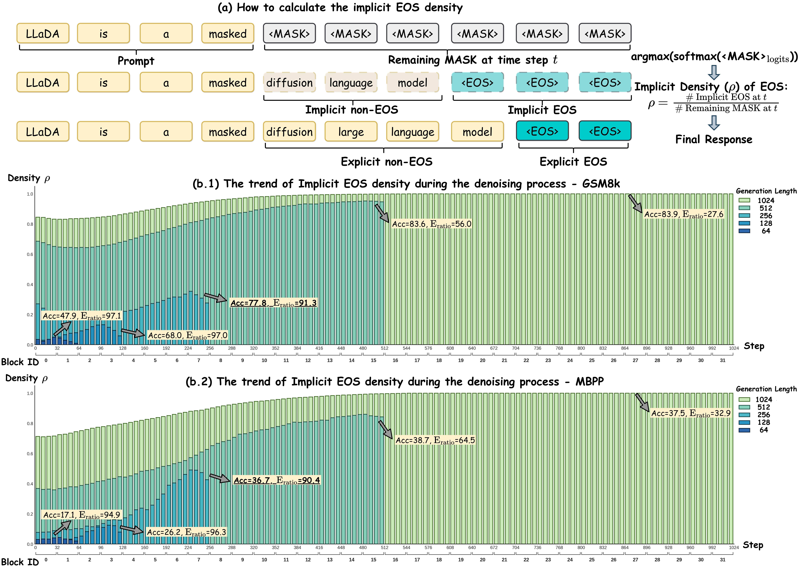
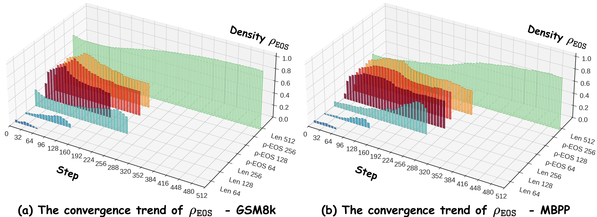
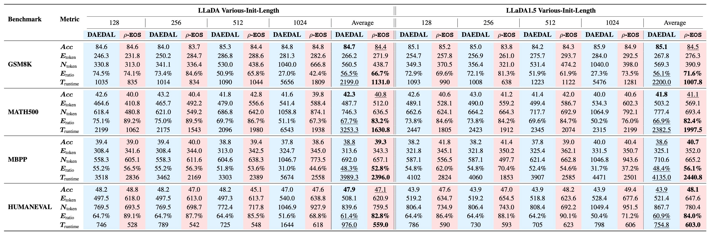
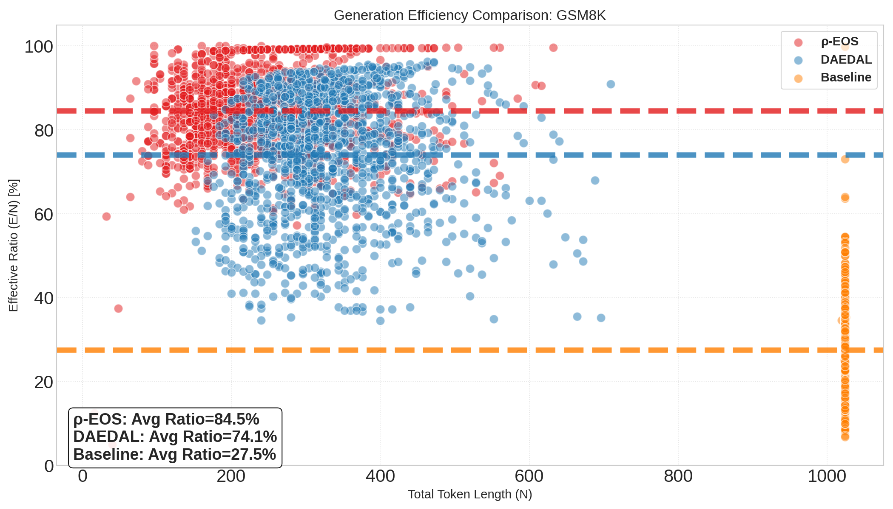
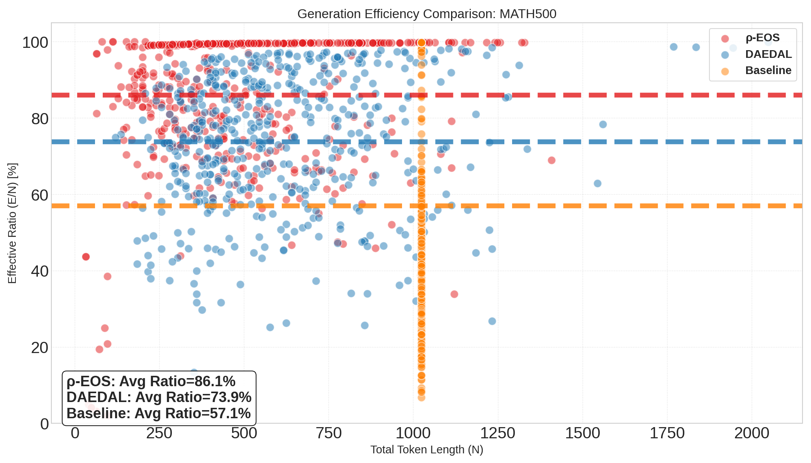
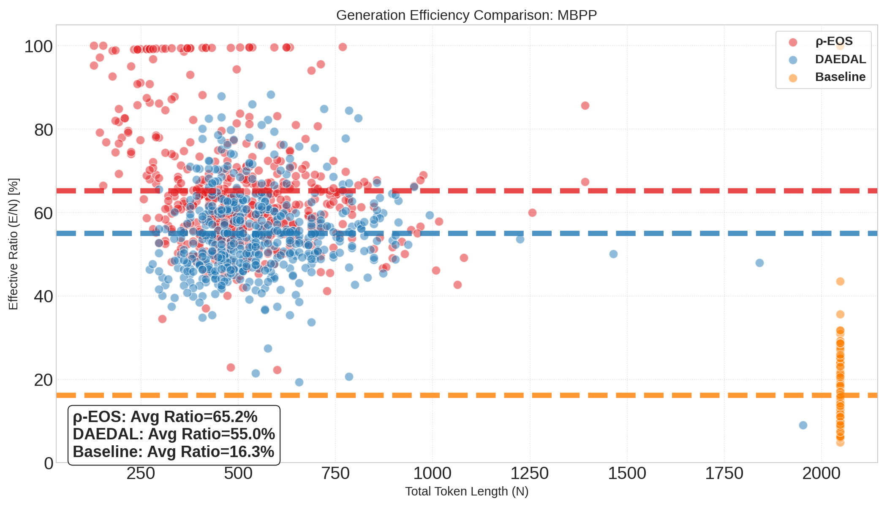
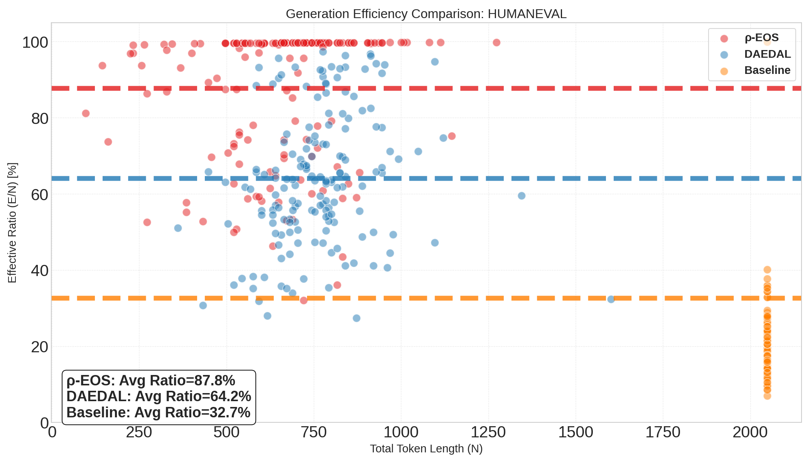
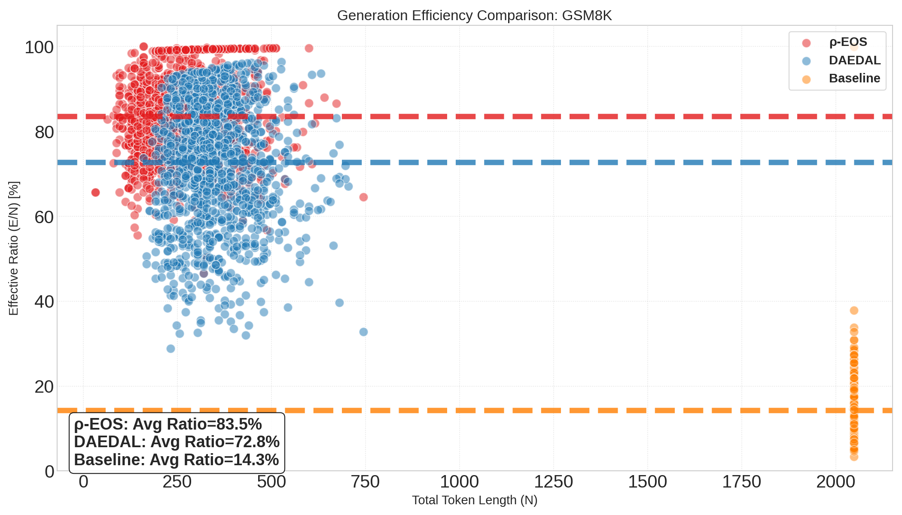
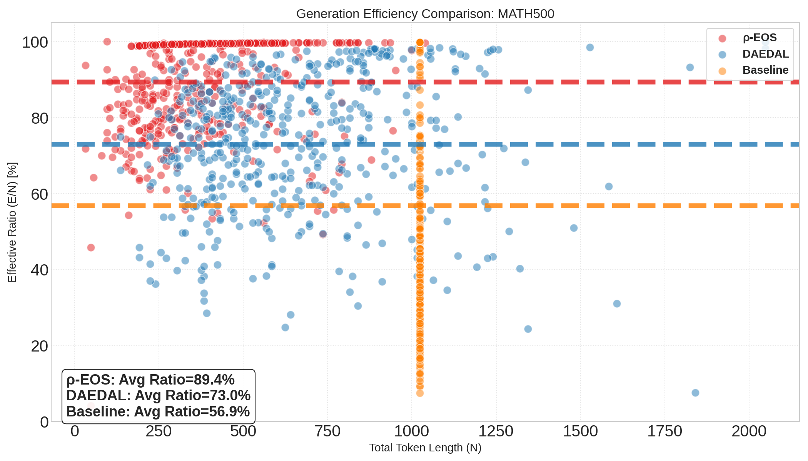
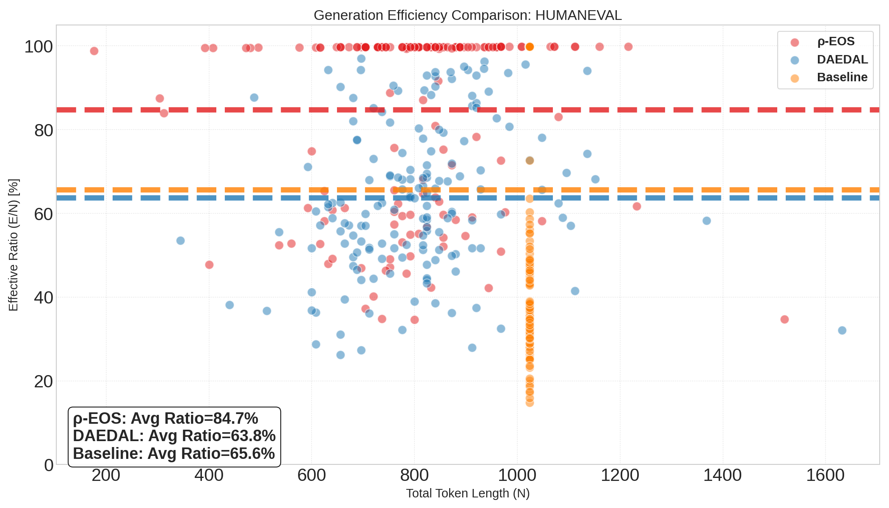

<div align="center">

<p align="center">
  
</p>

<h1><b>⍴-EOS</b>: Training-free Bidirectional Variable-Length<br>Control for Masked Diffusion LLMs</h1>

<div>
    <a href="https://yjyddq.github.io/" target="_blank">Jingyi Yang</a><sup>1,2</sup> |
    <a href="https://scholar.google.com/citations?hl=zh-CN&user=BrM8yHsAAAAJ" target="_blank">Yuxian Jiang</a><sup>1,2</sup> |
    <a href="https://amandajshao.github.io/" target="_blank">Jing Shao</a><sup>1</sup>
</div>
<br>
<div>
    <sup>1</sup> Shanghai AI Laboratory &nbsp;&nbsp; <sup>2</sup> Fudan University
</div>
<br>
<div align="center">

[](https://arxiv.org/abs/2501.22527)


</div>

---


<strong>💡 <b>⍴-EOS</b> is a `training-free` and `single-stage` strategy for `bidirectional` `variable-length` control via implicit EOS density (⍴) that unlocks dynamic and variable-length generation for Masked dLLMs (e.g., LLaDA), achieving performance comparable to, and sometimes superior to, meticulously tuned fixed-length baselines.</strong>

<details><summary><strong>📖 Click for the full abstract of <b>⍴-EOS</b></strong></summary>

<div align="left">

> Beyond parallel generation and global context modeling, current masked diffusion large language models (dLLMs) suffer from a fundamental limitation: they require a predefined, fixed generation length, which lacks flexibility and forces an inevitable trade-off between output quality and computational efficiency.
To address this, we study the denoising dynamics and find that the implicit density ($\rho$) of end-of-sequence ($\texttt{EOS}$) tokens serves as a reliable signal of generation sufficiency.
>
> In particular, the evolving implicit $\texttt{EOS}$ density during denoising reveals whether the current masked space is excessive or insufficient, thereby guiding the adjustment direction for generation length.
Building on this insight, we propose <b>$\rho$-$\texttt{EOS}$</b>, a training-free, single-stage strategy that enables bidirectional variable-length generation for masked dLLMs.
>
> Unlike prior two-stage approaches—which require separate length adjustment and iterative mask insertion phases while supporting only unidirectional expansion—<b>$\rho$-$\texttt{EOS}$</b> achieves bidirectional length adjustment within a unified denoising process by continuously estimating the implicit $\texttt{EOS}$ density: excessively high density triggers $\texttt{MASK}$ token contraction, while insufficient density induces expansion.
>
> Extensive experiments on mathematics and code benchmarks demonstrate that <b>$\rho$-$\texttt{EOS}$</b> achieves comparable performance while substantially improving inference efficiency and token utilization.
</details>
</div>

<br>

<div style="width: 100%; text-align: center; margin:auto;">
    
</div>


## 📢 News
- [2025/02/07] We released our code!
- [2025/01/30] We released our [paper](https://arxiv.org/abs/2501.22527) on arXiv!


## 💻 Overview
<div style="width: 100%; text-align: center; margin:auto;">
    
</div>
<br>

**Left (Standard & DAEDAL):** Standard denoising requires a fixed generation length, lacking flexibility and forcing an inevitable trade-off between performance and efficiency. DAEDAL uses a two-stage approach—first adjusting length, then iteratively inserting masks—but only supports unidirectional expansion.

**Right (⍴-EOS):** Our method performs denoising and length adjustment simultaneously within a unified loop. By monitoring the implicit EOS density (⍴<sub>EOS</sub>), it dynamically expands or contracts the generation length bidirectionally, achieving efficient and flexible variable-length generation.


## 📊 Evolution Trend of Implicit EOS Density

<div style="width: 100%; text-align: center; margin:auto;">
    
</div>
<br>

**The calculation of implicit EOS density:** During the denoising process, we calculate the implicit EOS density among the remaining masked positions: ⍴ = (Implicit EOS at step t) / (Remaining MASK at step t).

**(a-b) The trend of implicit EOS density during the denoising process:** The figures show how ⍴<sub>EOS</sub> evolves during generation on the GSM8K and MBPP benchmarks. Different colors represent different generation lengths. The implicit EOS density gradually converges as denoising progresses, providing a reliable signal for determining when the generation is sufficient.


## 📈 Variable-Length Generation Results

<div style="width: 100%; text-align: center; margin:auto;">
    
</div>
<br>

The table compares ⍴-EOS with DAEDAL across various initial generation lengths (128, 256, 512, 1024) on both LLaDA-8B and LLaDA-1.5 models. We evaluate on four benchmarks: GSM8K, MATH-500, MBPP, and HumanEval.

**Key findings:**
- **Robustness to initial length:** ⍴-EOS maintains stable performance regardless of the initial generation length
- **Better token efficiency and speedup evaluation:** ⍴-EOS achieves higher effective ratios, and reduce the runtime of evaluation
- **⍴-EOS consistently outperforms DAEDAL** across most settings, demonstrating superior accuracy (Acc) and effective token ratio (E<sub>ratio</sub>). ⍴-EOS achieves the best trade-off between generation quality and efficiency across all benchmarks


## ⚡ Token Utilization

We compare the generation efficiency of ⍴-EOS against DAEDAL and Baseline methods across four benchmarks. The **Effective Ratio** measures how efficiently tokens are utilized (non-padding tokens / total tokens).

### LLaDA-8B Results

| | GSM8K | MATH-500 | MBPP | HumanEval |
|:---:|:---:|:---:|:---:|:---:|
| |  |  |  |  |
| **⍴-EOS** | **84.5%** | **86.1%** | **65.2%** | **87.8%** |
| DAEDAL | 74.1% | 73.9% | 55.0% | 64.2% |
| Baseline | 27.5% | 57.1% | 16.3% | 32.7% |

### LLaDA-1.5 Results

| | GSM8K | MATH-500 | MBPP | HumanEval |
|:---:|:---:|:---:|:---:|:---:|
| |  |  |  |  |
| **⍴-EOS** | **83.5%** | **89.4%** | **64.1%** | **84.7%** |
| DAEDAL | 72.8% | 73.0% | 54.4% | 63.8% |
| Baseline | 14.3% | 56.9% | 33.5% | 65.6% |

**Observations:**
- **⍴-EOS (Red)** consistently achieves the highest effective token ratio across all benchmarks, a substantial portion of samples generated by ρ-EOS achieve an effective token ratio close to 100%
- **DAEDAL (Blue)** shows moderate token utilization improvement over baseline
- **Baseline (Orange)** uses fixed-length generation with the lowest token utilization


## 🛠️ Installation and Setup

### Repository and Environment Setup

```bash
git clone https://github.com/yjyddq/rho-EOS.git
cd rho-EOS

conda create -n rho-EOS python=3.10
conda activate rho-EOS

pip install -r requirements.txt
```

### Model Setup

After downloading [LLaDA-8B-Instruct](https://huggingface.co/GSAI-ML/LLaDA-8B-Instruct) and [LLaDA-1.5](https://huggingface.co/GSAI-ML/LLaDA-1.5), replace the `MODEL_PATH` in `scripts/*.sh` with your local path.


## 🎈 Quick Start

### Evaluate ⍴-EOS
```bash
# default configuration
sh scripts/eval_LLaDA_rho_EOS.sh
# specify RHO_LOW | RHO_HIGH and SCHEDULER
sh scripts/eval_LLaDA_rho_EOS.sh --rho_low 0.3 --rho_high 0.7 --scheduler exp
```

### Evaluate DAEDAL
```bash
sh scripts/eval_LLaDA_DAEDAL.sh
```

### Evaluate Baseline
```bash
sh scripts/eval_LLaDA_Baseline.sh
```


## 🔗 Citation

If you find our work helpful, please consider giving a star ⭐ and citation 📝
```bibtex
@article{yang2026rho,
  title={$\rho$-$\texttt{EOS}$: Training-free Bidirectional Variable-Length Control for Masked Diffusion LLMs},
  author={Yang, Jingyi and Jiang, Yuxian and Shao, Jing},
  journal={arXiv preprint arXiv:2601.22527},
  year={2026}
}
```

## 🙏 Acknowledgements

This code is built upon the following repositories. Sincere thanks to the authors for their wonderful work.
* [DAEDAL](https://github.com/Li-Jinsong/DAEDAL)
* [LLaDA](https://github.com/ML-GSAI/LLaDA/tree/main)
* [lm-evaluation-harness](https://github.com/EleutherAI/lm-evaluation-harness)
